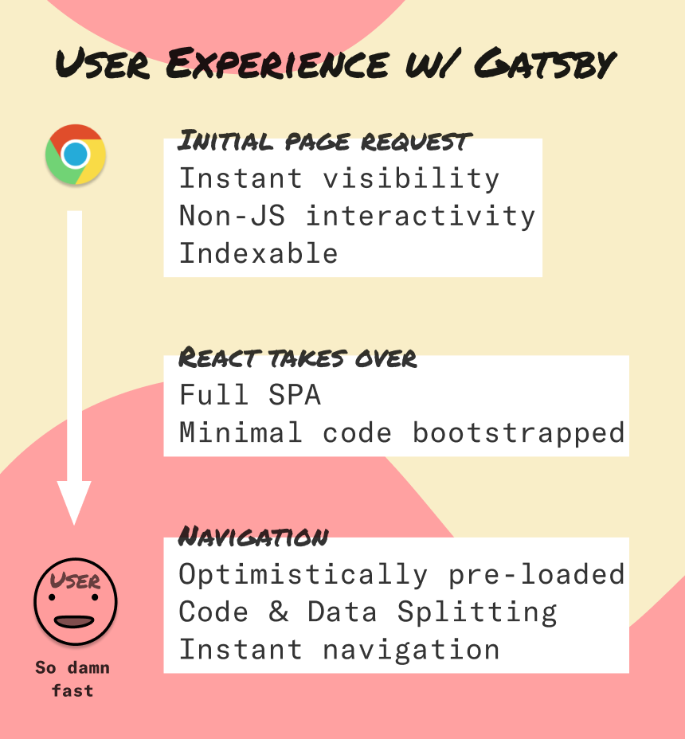
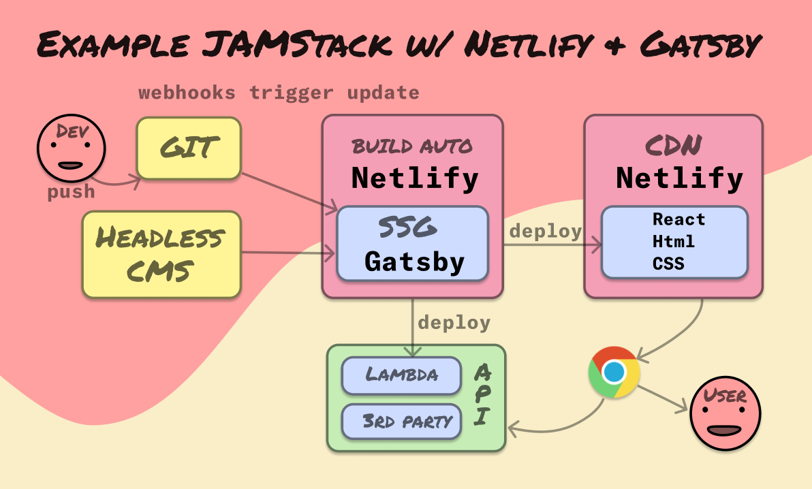

## JAMStack?

JAMstack refers to an architectural approach leveraging **J**avascript, **A**pis and **M**arkup, that lets you create rich websites and apps without servers. Build markup with a Static Site Generator, deliver with a CDN, and use JS + APIs for dynamic parts.

### So what’s so good with JAMStack?
- Best possible page load
- Best possible SEO
- Best possible security
- No servers needed
- No scaling needed
- Zero cost deployments

### LOFTY CLAIMS! How is this achieved?

A static site is mostly just a bunch of html files and images. You can just copy them up on any Content Delivery Network and have a new version deployed

Since no servers are involved, it also means no scaling needed, and zero security concerns. Just static files with pre-generated html means a deployment is a simple upload and that your content is visible as fast as possible to users and friendly to all crawler bots.

### That’ll take us back to the 90s in terms of Dev Experience and functionality. Can’t I have my modern React?

Enter **GatsbyJS**. You can have your cake and eat it too. It’ll pre-generate html files based on your React components, and re-hydrate your app as a fully fledged React app once the page has loaded.

### Ok. But we also have APPS and not just SITES. We need data, backends and our own very custom apis.

A lot of the backend functionality implemented in every project is re-inventing the wheel over and over again. Consider consuming some pre-existing services instead of adding more backend maintenance and ops work to your plate ad infinitum.

For example:
- Authentication (Auth0, Cognito)
- E-commerce (Snipcart)
- Payments (Stripe, Braintree)
- Search (Algolia)
- Comments (Disqus)
- Forms (Typeform)

Many of these can be integrated with pure frontend integrations. If you do need something custom, consider a serverless lambda/cloud function and outsource the tedious and costly ops and scaling part of backends.

### That just leaves us a bunch of frontend work.

Yep. If you ask me, Frontend is the new king (with some help from serverless offerings).

If you really want, you can still use your own hosted backends too. Just because part of your app ecosystem is JAMStacked and serverless doesn't exclude custom backends if that's the path of least resistance for you. If static files doesn’t fit for a portion of your frontend app, you can opt not to have that specific part of your app/site pre-generated as static files (Gatsby has you covered).

If you ask me, Frontend is the new king.

Minimizing your backend footprint with serverless options will go a long way of making your product iteration faster by letting you deliver new features by deploying a new static frontend. Have a new staging version deployed, ready for clicking, for every commit. It’s basically free, and fast.

Scale to infinity and pay as you go.
