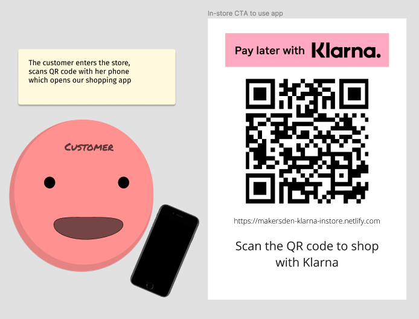
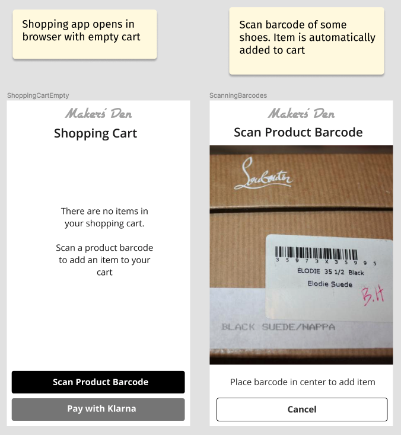
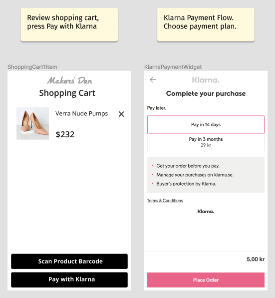
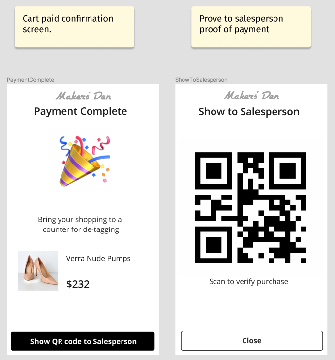
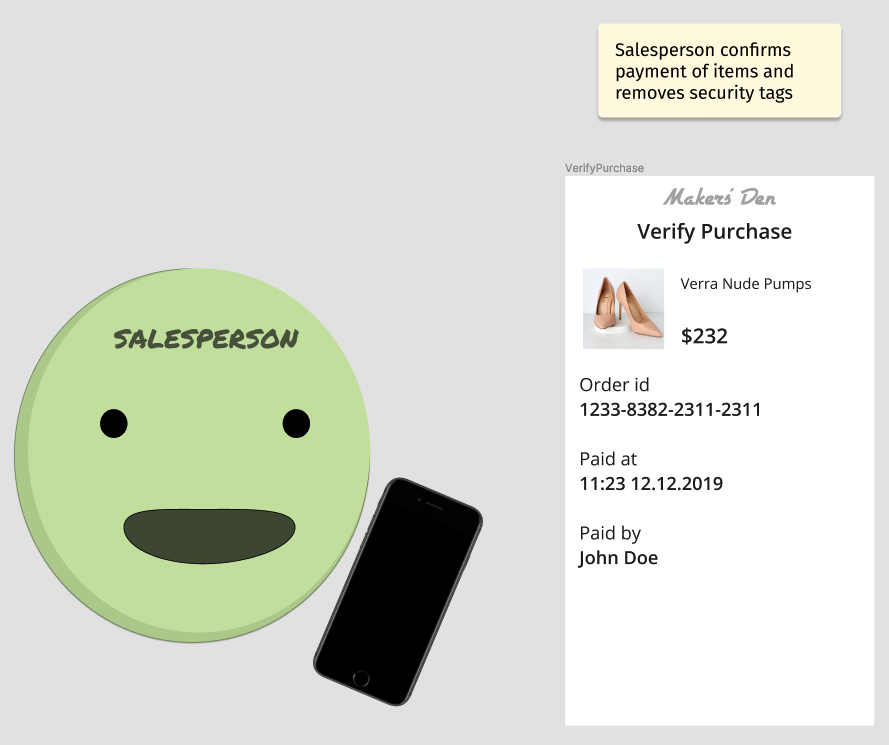
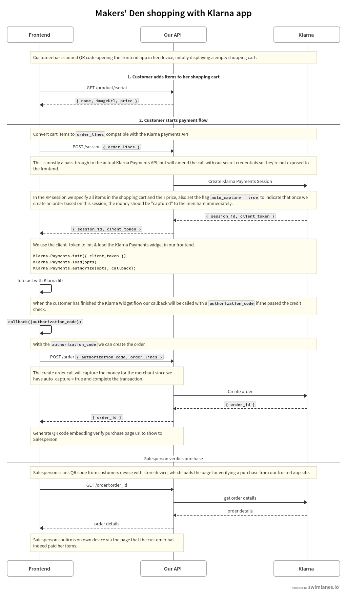

## Klarna?

Millennials don’t like credit cards (check e.g. [moneyexpert](https://www.moneyexpert.com/credit-cards/millennials-and-credit-cards/)) because they’re afraid of getting into debt. They want to be in control of how they manage payments. **[Klarna](https://klarna.com)** showed up on the market and provided us with an alternative to financing without paying everything up front and they’ve been expanding fast.

## Klarna Example Integration How-to & Demo

We’ve been creating a lot of various integrations towards Klarna APIs lately so I thought I’d do a small write up on how to do a simple in-store payment solution which allows you to shop and pay with your phone, selecting to pay later, whilst the store (aka the merchant) receives payment immediately.

Off we go!

## The Concept

Imagine **[Makers’ Den](https://makersden.io)** opened a shoe store, selling only the very best shoes. Inside the store we have a promotion for paying with Klarna through a custom app which makes the shopping experience largely self-service, and will allow the customer to choose how to finance her shopping.

## Technical details

For the nitty gritty on how the Klarna APIs work please refer to [Klarna’s official docs](https://developers.klarna.com). We are using the Klarna Payments API, it’s the most flexible api currently and a lot of different scenarios can be implemented using it.

The parts produced for this demo is a simple React frontend and a few cloud functions.

**A React frontend with two pages:**
- One for the customer to scan barcodes, manage the shopping cart and pay using Klarna.
- One for the salesperson to verify a customer's purchase.

**A few cloud functions implementing the following:**
- Fetching products based on serial numbers (mocked in our demo to a few hard-coded shoes).
- Creating a payment session via the Klarna API for the customer.
- Creating the final order, and fetching order information via the Klarna API.

## Sequence diagrams for our use cases

## Show me the money!

All the sources are found in a single repository here:
https://github.com/kallebertell/makersden-klarna-instore

To try the demo out now head here, https://makersden-klarna-instore.netlify.com/
Or scan this QR code:

Whilst this was a hypothetical in-store solution, you could basically use bits and pieces of this solution for any e-commerece site, or paying for lemonade at a lemonade stand. Lowering the bar for receiving payments makes all the difference - whether or not someone has cash on hand right now.

Get Smoooth.
